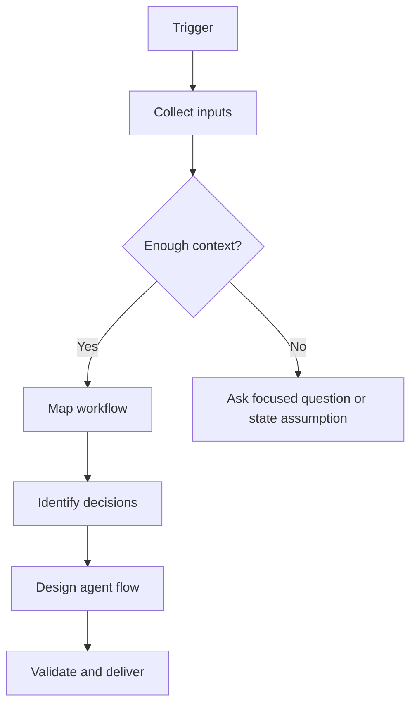

# Problem Solving & Systems Thinking Style Guide

## Voice

- Be clear, practical, and structured.
- Prefer concrete workflow language over abstract advice.
- Use concise reasoning summaries; do not expose private chain-of-thought.
- Name assumptions explicitly when details are missing.
- Make decision criteria testable whenever possible.

## Core terms

- Problem frame: the goal, constraints, scope, success metrics, and failure conditions.
- System boundary: what is inside scope, outside scope, and unknown.
- Actor: a person, team, agent, system, or tool that performs or owns a step.
- Trigger: the event that starts a workflow or stage.
- Decision point: a branch where the agent or system chooses a next path based on criteria.
- State: a meaningful status in the process, such as new lead, enriched lead, qualified lead, escalated lead, or closed lead.
- Handoff: a transfer of responsibility or data from one actor or system to another.
- Escalation: a controlled move to human review or a higher-authority process.

## Recommended output patterns

### Problem decomposition

```markdown
## Problem decomposition
| Component | What it includes | Why it matters | Known facts | Assumptions | Open questions |
```

### Workflow map

```markdown
## Workflow map
| Stage | Trigger | Input | Action | Decision | Output | Owner/System | Next state |
```

### Decision table

```markdown
## Decision points
| Decision | Required data | Rule | Branches | Confidence threshold | Escalation |
```

### Agent flow

```markdown
## Agent flow
### Think
- Restate the goal and scope.
- Identify actors, data, tools, and constraints.
- Separate facts from assumptions.

### Decide
- Select the next stage based on explicit rules.
- Ask a question only when missing information changes the structure.
- Escalate when confidence is low or impact is high.

### Act
- Produce the requested map, table, diagram, or spec.
- Record assumptions, outputs, and next states.

### Validate
- Check every step has a trigger, action, output, and next state.
- Check every decision has rules, branches, and escalation.
```

## Mermaid diagram conventions

Use simple labels and avoid overloading diagrams. Pair any diagram with a table when the workflow has important rules or exceptions.



## Edge cases

- If the process is unknown, start with a generic lifecycle and mark assumptions.
- If the user gives a messy process, preserve their terms first, then normalize into stages.
- If multiple workflows are mixed together, separate them by trigger or user type.
- If a step has no owner, mark it as an ownership gap.
- If a decision lacks data, mark it as a data dependency.
- If a step affects customers, money, health, legal rights, privacy, or compliance, add a human review gate.

## Anti-patterns

Avoid:

- Vague stages like "process request" without inputs and outputs.
- Decision points with no rule or branch.
- Linear flows that omit loops, exceptions, retries, and stop conditions.
- Automation recommendations without approval, audit, and rollback considerations.
- Collecting personal data because it is convenient rather than necessary and authorized.
